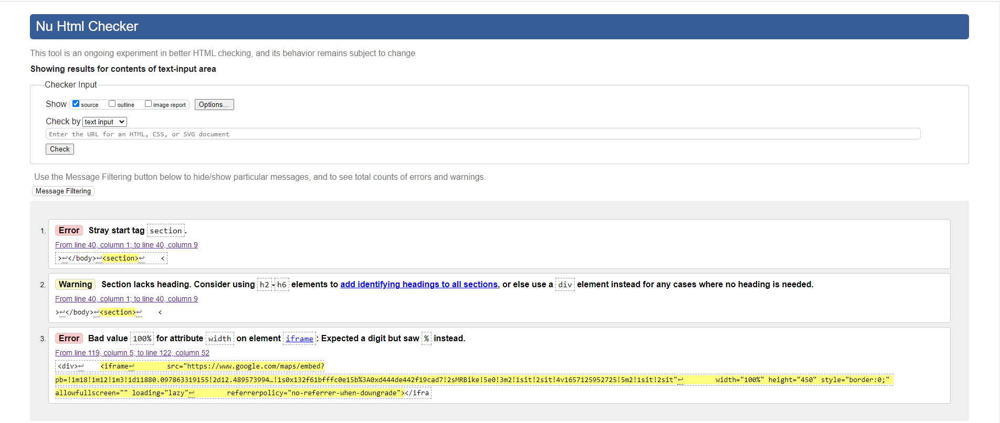
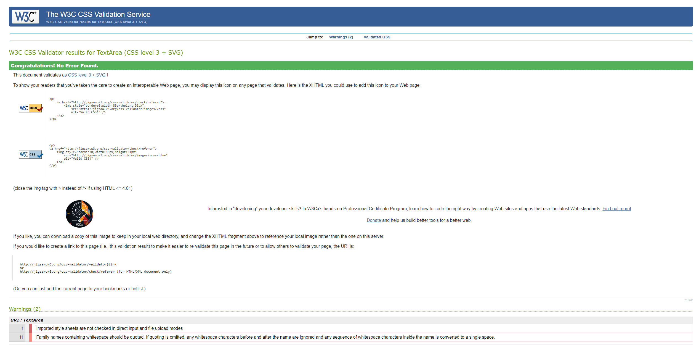
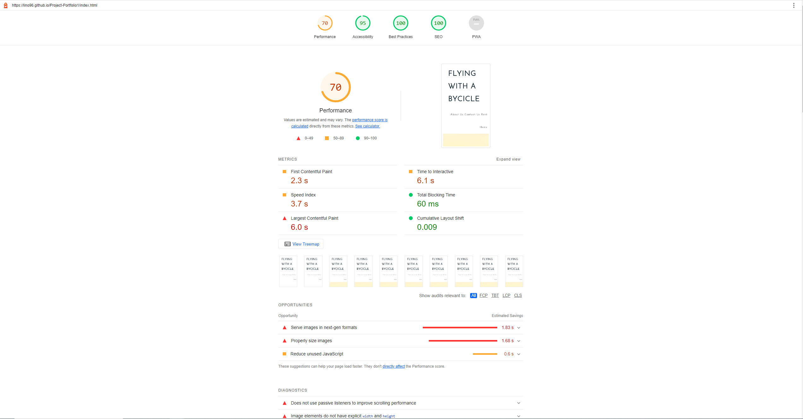
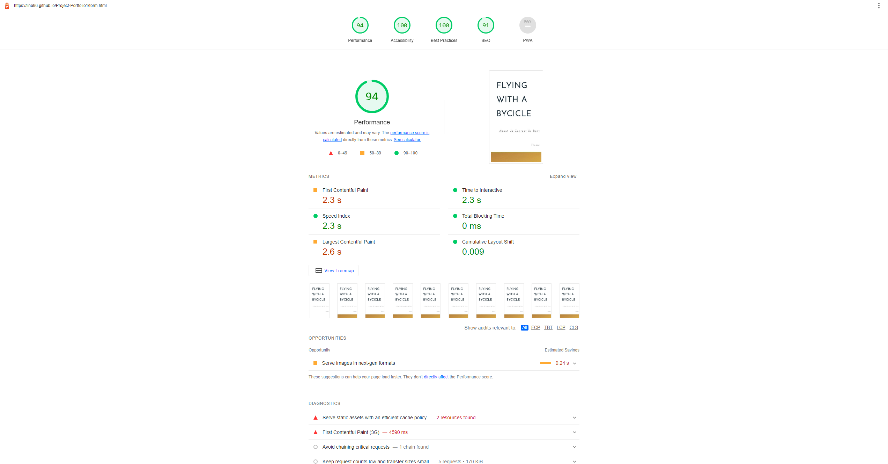

# **Flying With A Bike - Project Portfolio 1 - HTML & CSS_**

Flying with a bike is a store located in the middle of Rome, where you can Rent any type of bycicle you want and visit one of the most beautiful cities in the world.

On the Website, you're gonna be able to rent a bike by submitting a form, and to see all information about the store such as, opening times location and contacts.

## Main Page

In the Main Page There is the logo of the page at top left, the navigation menu at top right, the hero image, and then About Us and Contact Sections

In the About Us and Contact Us is possible to find informations such as the store location, contacts, and what's the store about, plus at the bottom of the page there are social media links which takes respectively to facebook, instagram and twitter account.

## Form Page

The Form Page is used to rent a bycicle, basically, by submitting the form and choosing the type of bycicle you want to rent.

## Bugs

## Bug Fixes

-Both First Two Errors were related to the same section, i solved by deleting the section, that wasn't really necessary

The only error i still got is related to the iframe width, i don't know why i can only insert a digit value instead of a percentage value

## CSS Validator

## Lighthouse Review

## Deployment

I deployed the page using Github. I opened my repository then i clicked on settings, after, on the left i clicked on pages and selected main branch, after that saved and the site was loaded 

[Here is the link of the site](https://lino96.github.io/Project-Portfolio1/index.html)

## Credits

-I Took Example from the I love running project for the hero-image settings and nav menu
-I took example from coffehouse project for the <meta> data

